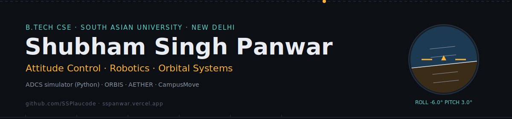

# Shubham Singh Panwar

CSE student at South Asian University, New Delhi. Working on attitude control, robotics, and orbital systems.

## Tech
Python · C++ · TypeScript · React · FastAPI · PostgreSQL

## Currently
- Building an ADCS (attitude determination & control) simulator in Python
- Extending [CampusMove](https://campusmove-wd9m.vercel.app), a real-time e-rickshaw queue platform, as part of a summer research internship

## Projects
- [ORBIS](https://github.com/SSPlaucode/orbis) — real-time satellite tracker (SGP4, TLE data)
- [AETHER](https://github.com/SSPlaucode/aether-acm) — autonomous satellite constellation manager

## 🛰️ Live orbital data
*Auto-updated every 6 hours via GitHub Actions*

<!--START_SECTION:iss-->
**ISS (ZARYA)** — Lat: 46.5°N, Lon: 101.1°E — Alt: 425 km — Vel: 7.66 km/s

Last sync: 2026-07-24 08:36 UTC · propagated with SGP4 from live Celestrak TLE, same approach as [ORBIS](https://github.com/SSPlaucode/orbis)
<!--END_SECTION:iss-->

## Links
[Portfolio](https://sspanwar.vercel.app) · [LinkedIn](https://linkedin.com/in/shubham-singh-panwar-34515b387)
